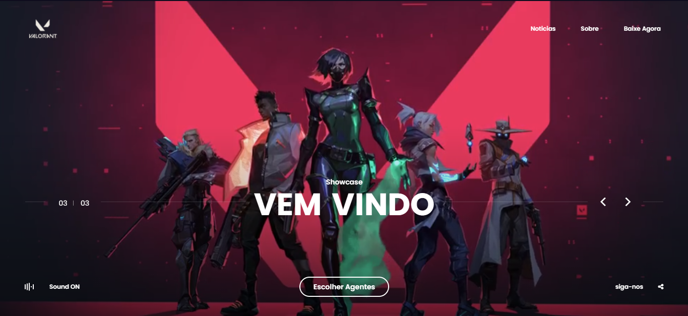

<h1 align="center">Desafio 7👋</h1>
<p>
  <a href="#" target="_blank">
    
  </a>
</p>

> Desafio 7 da codelandia do Iuri Silva finalizado porém com varias mudanças decidir usar o desafio somente como inspiração para desenvolver o website com a tematica de valorant lembrando o site pode ter alguns bugs foi criado para fins de estudo 

Veja o projeto final aqui:(https://jeffbeu.github.io/Desafio-7---Codelandia/)

## Run tests

```sh
just open index.html live server
```

## Author

👤 **JEFF (Douglas)**

* Website: http://douglasportifolio.tk/
* Github: [@jeffbeu](https://github.com/jeffbeu)
* LinkedIn: [@https:\/\/www.linkedin.com\/in\/douglas-oliveira-305961160\/](https://linkedin.com/in/https:\/\/www.linkedin.com\/in\/douglas-oliveira-305961160\/)

## Show your support

Give a ⭐️ if this project helped you!

***
_This README was generated with ❤️ by [readme-md-generator](https://github.com/kefranabg/readme-md-generator)_
